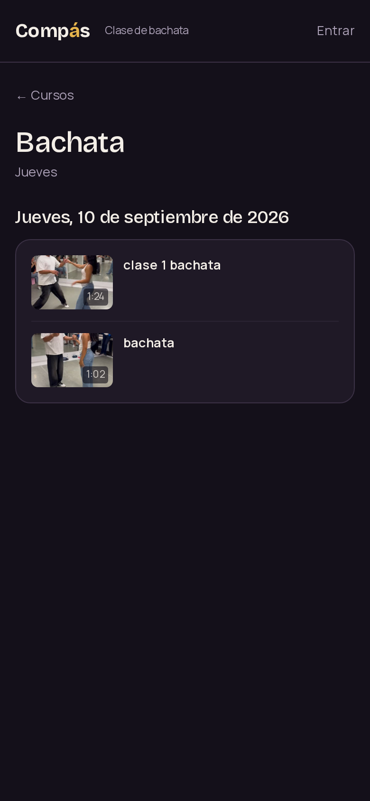
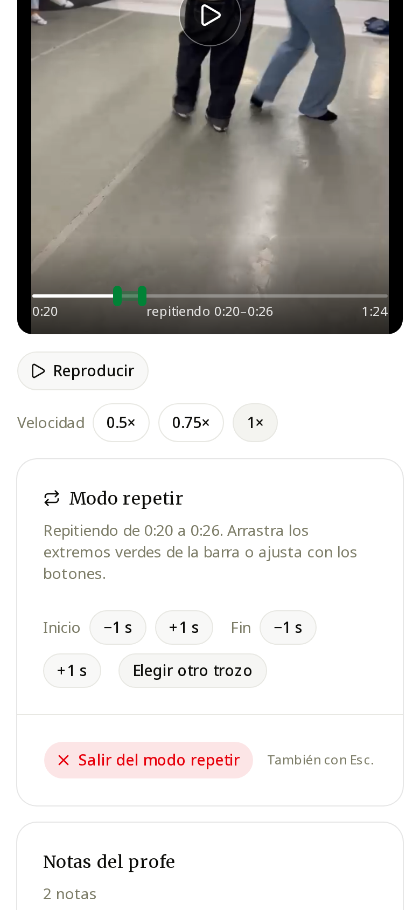

# clase-bachata

Plataforma de vídeos para una clase de bachata de doce personas: diez alumnos y dos profes. Cada jueves el profe sube desde el móvil los dos o tres vídeos de la clase, y todos los ven desde el navegador sin instalar nada.

Antes los vídeos se compartían por WhatsApp y se perdían en el scroll. Esto sustituye a WhatsApp con tres cosas que WhatsApp no hace:

- **Velocidad de reproducción** a 0,5x y 0,75x para ver el paso despacio.
- **Bucle entre dos marcas** para repetir un fragmento hasta que salga.
- **Nota del profe** por vídeo: "ojo al peso en el tercer tiempo".

En producción: https://clase-bachata.vercel.app. Las clases, los cursos y el reproductor son públicos; subir vídeos y dejar notas requiere cuenta de Google con rol de profe.

<p align="center">
  
  
</p>

## Arquitectura

```
Navegador ──(1) pide URL firmada──> Next en Vercel ──> Postgres (Supabase)
    │                                                       ▲
    └─────────(2) PUT directo──────> Cloudflare R2          │
                                            ▲               │
                         Worker en casa ────┘───────────────┘
                         (solo llamadas salientes; fase 1.5)
```

Dos decisiones sostienen el diseño:

1. **El fichero nunca pasa por Vercel.** El navegador pide a la API una URL firmada de diez minutos y hace el `PUT` directo a R2. Vercel limita el body a 4,5 MB; un vídeo original del móvil pesa 100 MB.
2. **Vercel y el ordenador de casa nunca se hablan.** La base de datos es el buzón: la web escribe una fila, el worker pregunta cada cinco minutos si hay trabajo. Sin puertos abiertos, sin túnel, sin IP fija.

## Por qué estas piezas y no otras

| Decisión | Alternativa | Motivo |
|---|---|---|
| Cloudflare R2 | Supabase Storage | El plan gratuito de Supabase da 1 GB y 50 MB por fichero; R2 da 10 GB y salida gratis. Un original del móvil no cabe en Supabase |
| Subida con URL firmada | Subir a través de la API | Límite de 4,5 MB de body en Vercel |
| Supabase para auth y Postgres | Auth.js + Neon | Menos configuración, y RLS con roles en la propia base de datos |
| Worker por sondeo cada 5 min | Cola (Redis, SQS) | Con tres vídeos por semana el resultado es idéntico con una décima parte del código. Cambiaría a cola con decenas de subidas por hora |
| Worker en el ordenador de casa | Transcodificación gestionada | La máquina ya está encendida 24/7. Coste cero |
| `<video>` nativo | video.js, plyr | Cero dependencias; `playbackRate` es una línea |

Presupuesto: 0 € al mes.

## Datos medidos

Tres vídeos reales de una clase, tal como salen de WhatsApp:

| Duración | Tamaño | Resolución |
|---|---|---|
| 45 s | 7,7 MB | 1024×576 |
| 62 s | 10,5 MB | 464×832 (vertical) |
| 84 s | 14,4 MB | 1024×576 |

Los tres salen de WhatsApp a ~1,3 Mbps sin importar la resolución: WhatsApp aplica un bitrate fijo, no comprime de forma inteligente. Los originales del móvil rondan los 100 MB por clip, unos 300 MB por semana; los 10 GB gratuitos de R2 dan para unas treinta semanas antes de necesitar el worker por espacio.

## Compatibilidad: el problema real

Los iPhone con "Alta eficiencia" graban HEVC (H.265) en un `.mov`. Safari lo reproduce; Chrome en Android y en escritorio, no. El profe sube, lo ve bien en su móvil, y media clase ve un reproductor en negro. Tres capas de defensa:

1. Ajuste de cámara del profe: Formatos → "Más compatible". Cinco minutos, cero código.
2. El uploader lee las cajas del MP4 en el navegador, sin decodificar, y rechaza HEVC con un mensaje que explica el ajuste. También saca de ahí duración, dimensiones y rotación, así funciona aunque el navegador del profe no tenga el códec.
3. El worker transcodifica a H.264 con `-vsync cfr -r 30` (los móviles graban con framerate variable y sin eso el audio se desincroniza) y `+faststart`.

## Roles

Tabla `profiles` con `admin`, `profe` o `alumno`. Quien entra con Google aparece como alumno; el admin le cambia el rol desde `/admin`. Solo admin y profes suben. Todo se aplica con políticas RLS, no solo en la aplicación.

## Diseño

Componentes de [shadcn/ui](https://ui.shadcn.com/docs/components) sin personalizar, con el preset `b4ccpYALa4` (Base UI, olive, acento verde, Noto Sans y Merriweather). Reglas, rutas y patrones de interacción del reproductor en [docs/DESIGN.md](docs/DESIGN.md).

## Desarrollo

```bash
npm i
cp .env.example .env.local   # rellenar
npm run dev
```

Migraciones en `supabase/migrations/`, para pegar en el SQL Editor. Scripts en `scripts/`: `r2-setup.mjs` crea el bucket y aplica el CORS; `r2-smoke.mjs` prueba una subida firmada de punta a punta.

El CORS del bucket es donde se pierde más tiempo: si el `PUT` falla con un error de red vacío, es eso.
